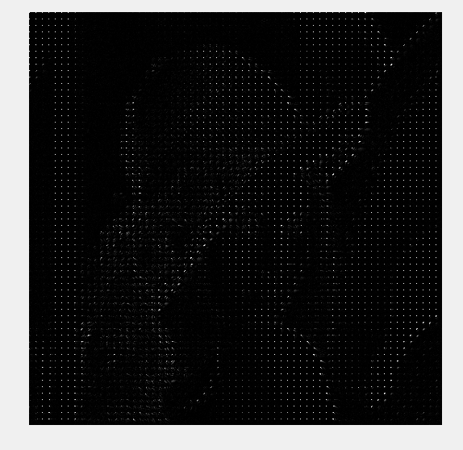

# JPEG_Compression
在matlab里实现JPEG的压缩
## JPEG压缩的基本流程
压缩流程：DCT2->量化->曲线阅读->编码->压缩码  
  
原图如下：  

## 二维离散余弦变换 DCT2
将图片分成8x8的矩阵进行DCT2变换  
变换的好处是一方面，从图像处理的整体流程而言，变换后便于后续处理；另一方面，从编码的角度而言，变换后使图像信息集中，在数学上体现为描述关键信息的系数变少，相应的，所需存储空间降低，达到降低视频体积的目的。  
变换后还可以进行高频过滤。  

  
经过DCT2变换的图像：  

## 量化 Quantification
高频率的信息更难被眼睛捕捉 用quant矩阵模拟眼睛的感知能力 对进行过DCT的图像再进行分块(8x8)量化  
量化效果通常用量化玩之后矩阵的中0的占比来衡量  
图像量化后0的占比例高达 **96.2734%**  
另外一种评估图像质量的方法是计算 Peak Signal to Noise Ratio(峰值信噪比) 的值  
PSNR值越大，就代表失真越少  
  
这里解码后的图像PSNR能得到 **30db** 左右的PSNR 还是人眼能察觉出差异的级别  
  
PSNR         |图像效果  
-------------|----------------------                   
**<10db**    |人眼无法判断图片是否相同
**10-20db**  |人眼可以识别原始结构 
**20-30db**  |人眼可以感觉出差异 
**>30db**    |人眼很难察觉压缩后图片的变化  
**~50db**    |压缩图像仅存在微小误差 

## 编码
Run Length
The DC coefficient of the 2D-DCT (discrete cosine transform) of an 8 x 8 image block,represents the average value of the samples within the 8 x 8 block.
矩阵最左上角的是采样平均值 跟FFT一样 被称为 此矩阵的DC值 此矩阵剩余的值被称为AC值
采用 Run Length Encoding (sur les zéros)
从矩阵左上角的DC值开始蛇形读取值，因为低频信号集中在左上角
编码写法为 (x1,y1)B1(x2,y2)B2...
其中B1表示非0数的二进制编码 如 -4->011
x1指的是B1所指的数之前有多少个0
y1指的是B1二进制编码的长度
    
Codage entropiaue (Huffman)
   将之前Run Length 码中的(x,y)部分再次编码，B部分不动